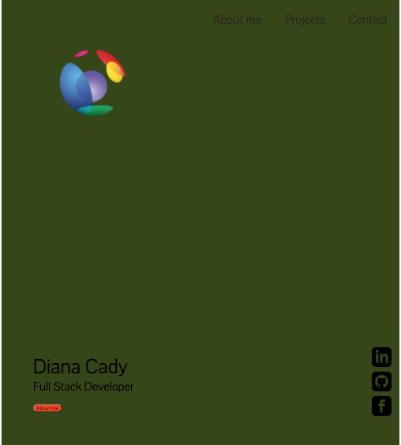
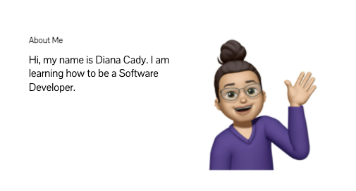
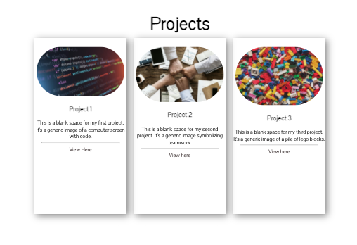

# Portfolio-

# About Me

Hi I’m Diana, I am a beginner, currently learning how to code. I don't have a coding backround and didn't know exactly what coding was about before I started the bootcamp.  A friend told me about coding and it sounded interesting to me. I am also pursuing a change in career and have always had an interest in learning about web design espeically phone apps.
I did a few code excercises and was attracted by the challenge of learning something completely new to me. Some of my strenghts is that I enjoy problem solving and attention to detail. After doing some research on line and getting more information on what a coder does, I realized that these are good strengths to have as a coder.

Currently, my career is in healthcare in the area of administration. I have 18 plus years of experience working in hosptial and clinic settings and 8 of those last years have been in management.

## Deployed Projects

Currently, my only deployed project is my portfolio. When viewing my portfolio
you will see my name, an avatar and links to a section about me, place holders for future projects, and how to contact me.
When clicking on the links in the navigation tabs, the UI scrolls to the corresponding section.
When resizing the page or if it's viewed on various screens and devices,
there will be a responsive layout that adapts to the viewpor

I had fun building this website and my goal is to make improvements by applying the materials that I'll be learning throughout this bootcamp.

Website URL:[Portfolio](https://molano1979.github.io/Portfolio-/)

