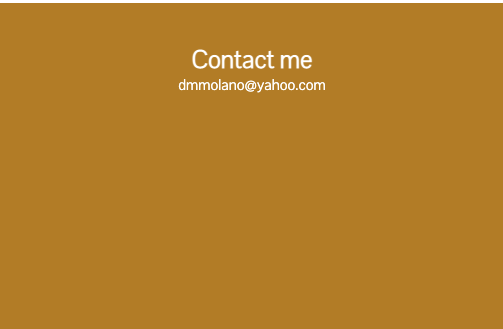

# Portfolio-

## About Me

Hi I’m Diana, I am a beginner, currently learning how to code. I don't have a coding background and didn't know exactly what coding was about before I started the bootcamp.  A friend told me about coding and it sounded interesting to me. I am also pursuing a change in careers and have always had an interest in learning about web design, especially phone apps.
I did a few code exercises and was drawn by the challenge of learning something completely new to me. Some of my strengths are that I enjoy problem solving and attention to detail. After doing some research on line and getting more information on what a coder does, I realized that these are good strengths to have as a coder.

Currently, my career is in healthcare in the area of administration. I have 18 plus years of experience working in hospital and clinic settings and 8 of those last years have been in management.

### Deployed Projects

My current deployed projects are my updated portfolio and the first class project we worked in as a team named. When viewing my portfolio
you will see my name, an avatar and links to a section about me, link to my first project and place holders for future projects, and how to contact me.
Since the last time workingon this portfolio, I have learned CSS, JavaScript and currently Node.JS. I've added a countdown timer to the last day of bootcamp to upgrade my portfolio with my JavaScript skills.

When clicking on the links in the navigation tabs, the UI scrolls to the corresponding section.
When resizing the page or if it's viewed on various screens and devices,
there will be a responsive layout that adapts to the viewport.

Website URL:[Portfolio](https://molano1979.github.io/portfolio-diana-cady/)

